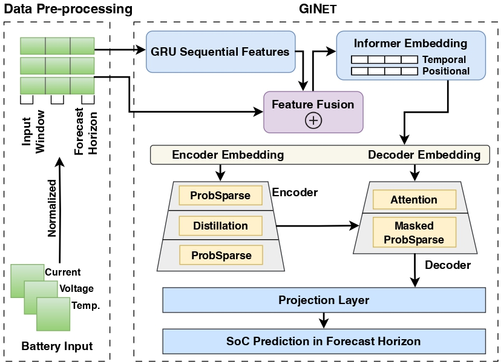

# GiNet: Integrating Sequential and Context-Aware Learning for Battery Capacity Prediction

## Introduction
This is the official implementation of the following paper: [GINET: Integrating Sequential and Context-Aware Learning for Battery Capacity Prediction](https://arxiv.org/pdf/2501.04997). We propose GINET, a gated recurrent units enhanced Informer network, for predicting battery’s capacity. The novelty and competitiveness of GINET lies in its capability of capturing sequential and contextual information from raw battery data and reflecting the battery’s complex behaviors with both temporal dynamics and long-term dependencies.

## Dataset
The data utilized in this project comes from the following source and is publicly available: 
[Panasonic 18650PF Li-ion Battery Data](https://data.mendeley.com/datasets/wykht8y7tg/1)

## Requirements
- Python == 3.12.5
- matplotlib == 3.9.2
- numpy == 1.26.4
- pandas == 2.2.2
- scikit_learn == 1.5.2
- torch == 2.5.1+cu124

Dependencies can be installed using the following command:
```bash
pip install -r requirements.txt
```

## Model Overview


## Acknowledgement
This work was supported in part by SIT’s Ignition Grant (STEM), A*STAR under its MTC Programmatic, MTC Individual Research Grants (IRG), and the National Research Foundation, Singapore and Infocomm Media Development Authority under its Future Communications Research & Development Programme.
